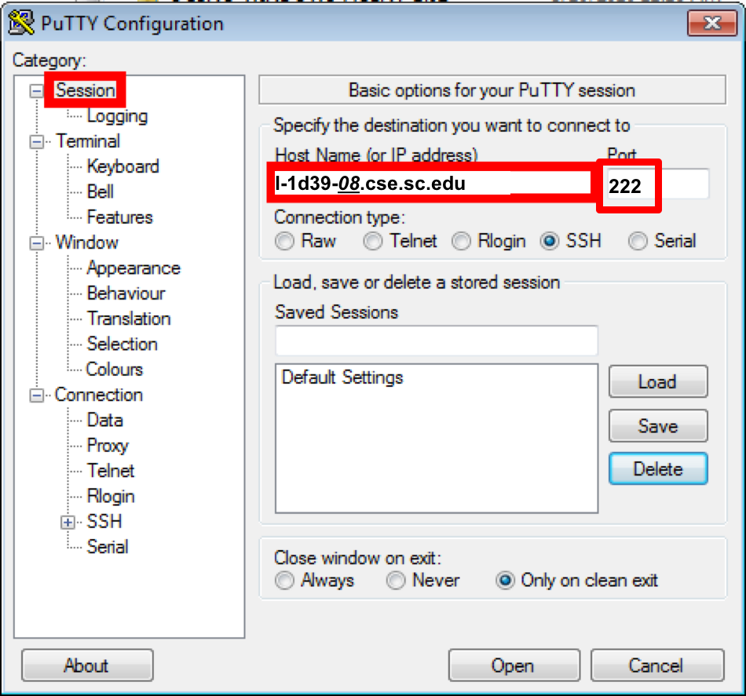
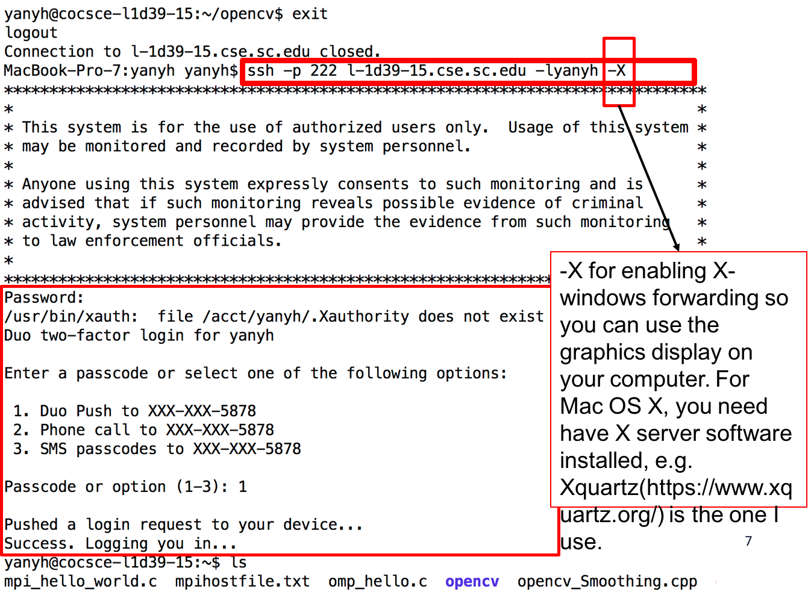

## **Using ssh to access remote machines**

### **Windows: Using putty**

****

### **Mac OS X and Linux: Using ssh command**

****

---

## **Using winscp/scp to copy files between local and remote machine**

### **Windows: using winscp (https://winscp.net/eng/download.php)**

### **Mac OS X and Linux: using scp command**

1. For example: copy a local file to remote machine: scp \-P 222 local\_file.txt yanyh@l-1d39-26.cse.sc.edu:\~/remote\_folder\_under\_home/  
2. Copy a local folder to a remote machine: scp \-P 222 \-r local\_folder yanyh@l-1d39-26.cse.sc.edu:\~/remote\_folder\_under\_home/  
3. Copy a remote file to local machine: scp \-P 222 yanyh@l-1d39-26.cse.sc.edu:\~/remote\_folder\_under\_home/remote\_file.txt ./local\_folder  
4. Copy a remote folder to local machine: scp \-P 222 \-r yanyh@l-1d39-26.cse.sc.edu:\~/remote\_folder\_under\_home ./local\_folder  
5. If you want to just download a file from internet to a remote machine, you can use wget to directly download it from the remote machine after log-in (so no need to download locally and then copy to the remote machine). E.g. wget https://passlab.github.io/CSCE569/Assignment\_3.zip

---

## **Display application GUI locally from a remote machine using ssh X forwarding**

You will need to enable X forwarding when login in a remote machine usign ssh utilities (putty or ssh command) and also have a display server up running on your local machine.

1. **Enable X forwarding for ssh**:  
   1. Windows: Check putty configuration, you will see the X forwarding option somewhere.  
   2. For using ssh command, you will need to add \-X flag, see above.  
2. **Start a display server on local machine** You will also need to have a display server on your local machine so GUI interface will be forwarded to your local machine to display.  
   1. For Linux desktop environment, you do not need to do anything as display server is already on.  
   2. For Windows, install and start [Xming](http://www.straightrunning.com/XmingNotes/)  
   3. For Mac OS X, install and start [XQuartz](http://xquartz.macosforge.org/)
